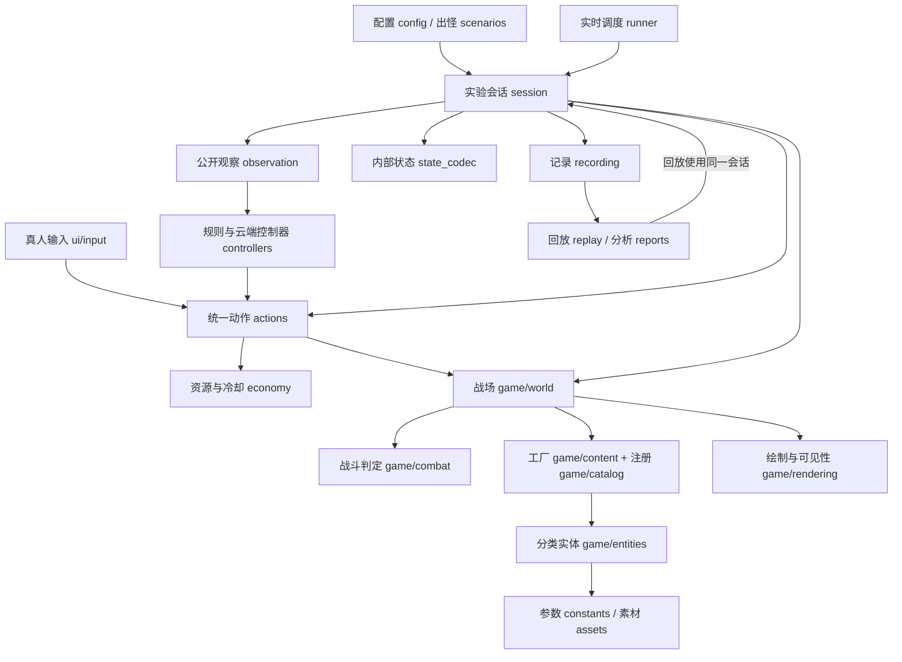

# 白天实验室 V2：开发与交接说明

本页负责架构、接口、扩展入口与迁移说明。操作和云端配置见 [使用说明](../README_DAY_LAB.md)，记录协议见 [数据格式](DATA_FORMAT.md)，原作者声明见 [来源与使用限制](UPSTREAM.md)。

## 1. 项目边界与阅读路线

这是个人研究用的 PvZ 实验环境，不是通用引擎，也不是为玩家发布的改版。保留上游游戏对象、素材和战斗设计；去掉普通通关应用流程。程序版本是 2.0.0，默认实验规则仍叫 day_lab_v1：架构升级不等于偷偷改变基准规则。

建议按以下顺序阅读：

1. `daylab/config.py`、`daylab/scenarios.py`：实验条件与外部事件安排。
2. `daylab/session.py`：一局实验的生命周期及每步顺序。
3. `daylab/actions.py`、`daylab/economy.py`：统一操作、资源与冷却。
4. `game/world.py`、`game/combat.py`、`game/content.py`：战场、战斗规则、内容创建。
5. `daylab/observation.py`、`daylab/state_codec.py`、`daylab/recording.py`：信息边界和数据出口。
6. `daylab/controllers.py`、`daylab/runner.py`、`daylab/ui/`：决策来源、现实时间调度和界面。

## 2. 架构与依赖

### 云端提示词与暂停思考接口

提示词文件与风格文件路径由 CloudConfig.prompt_file / style_file 指定，相对路径基于项目根目录；load_bundle() 校验并保存原文与哈希，render_prompt() 渲染静态规则与输出协议。不要再在控制器里拼接新的风格提示。编辑文件后重新 CloudConfig.load()，运行中的配置快照不变。

本地程序接入示例（API 密钥照常从环境读取）：

```python
from daylab.controllers import CloudConfig
from daylab.config import ExperimentConfig
from daylab.session import GameSession
from daylab.runner import make_controller, make_runner

cloud = CloudConfig.load("cloud.deepseek.example.json")
session = GameSession(realtime=False, execution_mode="pause_think")
session.reset(ExperimentConfig(actor="cloud"), seed=7)
controller = make_controller("cloud", cloud)
runner = make_runner(session, controller)
# 在主线程的事件循环中调用 runner.pulse(dt_seconds, monotonic_now)。
# 即使思考暂停，也持续处理窗口事件；不要同时自行调用 session.advance()。
# finally: controller.close(session); session.close()
```

CloudController.poll(..., allow_request=False) 只接收在途结果和更新记忆，不发起新请求；由 PauseThinkRunner 用来隔离“推进”与“决策”等待阶段。暂停调度器用模拟步决定观察时效，用现实时间决定 HTTP 超时；错误最多纠错一次，之后无动作推进。预算耗尽以技术状态结束，避免永久冻结。realtime 模式仍使用 RealtimeRunner，不共享暂停模式成绩。



图中是职责关系，省略了事件回调。`game` 不导入 `daylab`；战场和跟踪对象通过传入的会话对象调用 `register/damage/removed/emit` 等钩子，因此它仍是本项目内的合作式组件，并不是完全独立的第三方引擎。

以下边界应持续保持：

- 控制器只决策并提交命令，不调用时间推进，不改实体或阳光。
- 绘制不推进动画、不扣费、不改变战斗状态。动画更新属于模拟步。
- 资源只存在于 `ResourceLedger`，卡片只有图像和显示数据。
- 公开观察只能从明确白名单生成，不能直接把内部对象或完整事件流送给 AI。
- 报告读取记录文件，不依赖 Pygame 实体实例。
- 当前 Python 同进程接口不是安全沙箱；`level/entities/internal_state/events` 等是本地诊断能力，不是给不可信控制器的权限隔离。

## 3. 目录与模块责任

| 位置 | 负责 | 不负责 |
|---|---|---|
| `game/catalog.py` | 受支持内容、显示名称、构造类别、参数白名单 | 动画、运行中的生命值 |
| `game/content.py` | 实体工厂、实验射击时钟和自动产阳的明确覆盖 | 玩家输入、云端调用 |
| `game/entities/plants/` | 基类、经济、射手、防御、爆炸、特殊植物行为 | 实验选择界面 |
| `game/entities/zombies/` | 基类、地面僵尸、保留的特殊僵尸行为 | 出怪时间表 |
| `game/entities/projectiles.py` | 子弹与攻击效果对象 | 关卡安排 |
| `game/entities/props.py` | 小推车、阳光对象、坑和场地对象 | 自动入账权威状态 |
| `game/map.py` | 格子坐标与占用规则 | 人机操作频率 |
| `game/combat.py` | 从原 Level 提取的战斗判定 | 菜单、暂停、普通通关 |
| `game/world.py` | 精灵组、创建/移除、更新与碰撞组合 | 阳光账本、动作验证 |
| `game/tracking.py` | 创建、移除、伤害的跟踪钩子 | 文件输出 |
| `game/rendering.py` | 战场绘制顺序、实际像素可见性 | 时间与战斗推进 |
| `game/assets.py` | 显式 Pygame 初始化、加载和卡牌图像 | 原版状态机 |
| `daylab/config.py` | 配置校验、不可变参数、共同规则说明 | 具体攻击实现 |
| `daylab/scenarios.py` | 由种子生成完整环境事件安排 | 根据存活敌人数提前刷新 |
| `daylab/contracts.py` | 三种动作的格式与模型 JSON Schema | 执行时资源和目标检查 |
| `daylab/cloud_context.py` | 可逆的云端输入压缩、历史差异和参考解码 | 删除公开信息、读取隐藏状态、修改游戏记录协议 |
| `daylab/board_context.py` | text_board_v1 文字棋盘、时间序列摘要、当前实体及卡片表 | 读取内部状态、改变动作规则、宣称历史无损 |
| `daylab/cloud_memory.py` | 有界单局公开事实、计数、策略备忘与清空 | 把计划当成执行事实、读取隐藏血量/未来出怪 |
| `daylab/prompting.py`、`prompts/` | Markdown模板、风格JSON、校验、加载快照与内容校验值 | 在对局中热更新实验条件 |
| `daylab/cloud_transport.py` | 严格 JSON、可终止 HTTP 子进程、总时限与凭据隔离 | 决策和游戏状态修改 |
| `daylab/cloud_metrics.py` | 按请求 ID 分层统计、旧记录兼容、未知用量 | 把未知用量当作零费用 |
| `daylab/actions.py` | 提交、去重、限频、执行与失败原因 | 鼠标选卡、网络请求 |
| `daylab/economy.py` | 阳光余额、价格、冷却结束时间 | 独立 UI 余额 |
| `daylab/session.py` | 生命周期、时钟、事件协调、结果 | 具体植物技能 |
| `daylab/runner.py` | 现实时间积累、固定步推进、时序异常 | 改变模拟规则 |
| `PauseThinkRunner`（runner.py） | 请求期间冻结、决策后定量推进、错误与预算结束 | 把思考等待时间补成游戏步 |
| `daylab/observation.py` | 公开观察的字段白名单 | 内部血量与未来安排 |
| `daylab/state_codec.py` | 内部校验状态、对象引用转换 | 给模型输入 |
| `daylab/schemas.py` | 程序、清单与各数据流版本边界 | 自动猜测未知版本 |
| `daylab/recording.py` | 严格 JSON、校验值、文件和版本指纹 | 计算胜负 |
| `daylab/replay.py` | 从开局重新执行、比较检查点 | 重新调用模型 |
| `daylab/reports.py` | 指标、同局面采样、CSV/HTML | 改写原始实验数据 |
| `daylab/ui/` | 启动菜单、输入、画面、游玩/回放窗口 | 另一套种植规则 |

实体分类是按职责分组，不是“一种植物一个文件”。原有特殊内容的类仍保留；出现在 `entities` 中并不表示已获得实验支持。`catalog` 与工厂映射共同决定允许接入的内容。

## 4. 一局如何运行

`GameSession.reset()` 校验并复制配置，重新创建随机源、地图、实体组、队列、时钟、资源和编号；默认启用记录时创建新的对局目录。它不读写原版通关存档。导入模块不会打开窗口；reset 显式初始化所需图片与遮罩。无窗口模式也需要图像参与碰撞与可见性校验。

每 20ms 的顺序固定：

1. 递增模拟时间，处理已排队动作。
2. 派发所有到期出怪事件，不只派发一只。
3. 更新子弹、植物、僵尸、小推车及动画。
4. 处理碰撞、攻击判定、伤害、死亡和对象移除。
5. 结算自然阳光与向日葵产出。
6. 判定失败、胜利、超时。
7. 发布公开观察；按频率写观察、等待样本和内部检查点。

真人选卡和右键取消只是界面操作；点击格子时才提交 `PLACE_PLANT`。AI 也提交相同命令。提交成功表示进入队列，不表示执行成功；最终结果看 `action_result`。两者默认都受 200ms 提交间隔约束。

执行器检查启用名单、坐标、占用、阳光、冷却或铲除目标 ID。正常验证失败不扣费。实体先完成构造，再提交地图和账本变化。不存在故意吞掉内部异常并继续假装种植成功的逻辑；技术异常结束实验并记录原因。

子弹生成时记录来源植物，命中、伤害、生命值耗尽、进入死亡状态和动画完成后的移除是不同事件。铲除、自爆消耗、被吃掉也分别记录。

## 5. 给控制器使用的接口

```python
from daylab import GameSession, ExperimentConfig

with GameSession(headless=True, record=False) as session:
    observation = session.reset(ExperimentConfig(actor='test'), seed=42)
    receipt = session.submit(
        {'type': 'PLACE_PLANT', 'plant_type': 'SunFlower', 'row': 0, 'col': 0},
        observation['observation_id'],
        command_id='decision-1',
    )
    session.advance(1)  # 仅离线测试；实时控制器不能调用
    results = session.events(after_seq=0)  # 本地诊断流，包含隐藏战斗数据
    observation = session.observe()
```

示例用 `record=False` 避免生成演示记录；正式实验保留默认 `record=True`。`headless` 只决定是否显示窗口，不等于关闭记录或跳过碰撞所需资源。

稳定入口：`reset`、`observe`、`public_context`、`submit`、`events`、`advance`、`close`。`step_realtime` 属于宿主 runner；`cell_at`、`render_scene` 属于界面宿主。`level` 和 `entities` 属于内部诊断入口，不承诺第三方直接修改它们的兼容性。

`observation_id` 包含局 ID 和模拟步；旧局、过时观察被拒绝。同一命令 ID 重复提交不会再次执行；同 ID 换内容会冲突。主线程是唯一写入者，云端工作线程只处理复制后的公开输入。

云端提交被接收后，控制器必须等至少下一个完成的模拟步再读取局面、发起新请求。`submit` 只是排队，立即再次 `observe` 仍可能读到扣费、占用和冷却更新前的局面；`CloudController.next_observation_tick` 用于阻止这种错误时序。它不会暂停游戏或延长观察有效期。

## 6. 修改实验条件：优先改配置

启动菜单可选择 `configs` 中的 JSON；配置不为空时，它决定卡组、场景与参数，上方控制者/练习开关和种子仍生效。空配置保持原来的三个预设。

可调字段：

- `enabled_plants` / `enabled_zombies`：必须是已注册并验证的名称。
- `initial_sun` / `max_time_ms` / `action_interval_ms`：资源、时限和双方共同限频。
- `wave_start_ms` / `wave_interval_ms` / `wave_counts`：出怪节奏与各波数量。
- `wave_types`：可选的逐波敌人名称列表，数量必须与 `wave_counts` 一致；不填则沿用预设组合。
- `plant_overrides`：按植物名称覆盖允许的参数。一般支持初始 `health`、`cost`、`cooldown_ms`；三种射手另支持 `shot_interval_ms` 和 `first_shot_delay_ms`。樱桃炸弹不开放血量覆盖。
- `zombie_overrides`：初始 `health`、`speed`；有一类防具的僵尸可改 `helmet_health`。

只允许白名单数值，不允许任意修改对象属性。时间覆盖必须为 20ms 的正整数倍。价格可为 0；速度范围 0.05～10。参数范围合法不代表已做难度平衡。提高初始血量不会自动按比例调整原有受损贴图、掉头等阈值；需要这样的规则应明确另作变更与测试。

`configs/expanded_day.json` 演示七张卡、高坚果和旗帜僵尸。`configs/pressure_parameters.json` 演示参数与波次压力调整，不替代默认基准。

配置嵌套参数在运行时冻结；不要运行中修改配置。修改后重新 reset，使清单、条件标识和实际游戏一致。默认配置省略新增字段的默认值，保持 V1 默认实验条件标识不变。

## 7. 接入原项目已有的另一种内容

1. 在 `entities` 找到原类，先阅读其构造参数、特殊碰撞、随机调用和外部引用。
2. 在 `catalog.py` 声明名称、显示名、构造类别、允许参数；在 `content.py` 注册构造类。
3. 普通结构可沿用现有工厂；特殊构造明确添加分支。不要把特殊技能硬塞进通用参数。
4. 检查占用、动作限制、可见观察、来源事件和内部检查点。复杂对象不能仅靠目前标量扫描就假设完整记录。
5. 若调用随机数，接入会话的专用随机源；不能直接把保留类中的全局随机逻辑当成确定性已验证实现。
6. 补行为测试、隐藏/启用测试、死亡/铲除测试、重置及可验证回放。
7. 再加入实验配置。不要直接扩大默认卡组和旧预设的难度。

当前经过实验接入的额外内容只有高坚果和旗帜僵尸。其他原类虽然已分类保留，但并未全部承诺实验正确性。

## 8. 修改记录和分析

详细字段与版本策略见 [数据格式](DATA_FORMAT.md)。新增分析指标通常只改 `reports.py`。新增公开字段改 `observation.py`，必须检查信息泄漏。新增内部校验字段改 `state_codec.py`，需要考虑旧记录的检查点差异。语义或结构改变要升级对应流版本并提供明确读取/迁移逻辑，不能只把版本数字增加后继续盲读。

当前 `state_codec.entity_state` 对标量和引用仍采用受控扫描加显式转换，它不是任意 Python 对象的通用存档器。新增列表、集合、自定义子状态需要显式编码和测试。也没有实现任意时刻直接恢复对象；回放始终从开局快进。

## 9. 回归与交接

开发期间的回归测试代码、测试入口、自动测试对局和验证报告已按用户要求移到回收站，当前目录不再附带这套测试用例。真人记录和产品内的回放校验功能保留。

后续修改仍需针对变更补充验证：动作失败不能扣费、自动阳光不能重复入账、重置不能残留状态、观察不能泄漏内部信息；战斗、时钟、记录编码或内容构造变化还需验证整局回放。更多内容接入时同时验证对应行为与配置限制。

正常同版本记录可用 `python -B -m daylab replay experiments/某局目录 --verify` 检查；跨版本需显式使用 `--migration-check`，不能把跨版本状态一致当作同版本验证。仅改文档不改变代码指纹。保留的研究记录不应在验证过程中改写或删除。若规则有意变化，要说明预期差异并建立新基准，不允许把失败的旧回放强行标为通过。

## 10. 已知边界

- 仍依赖 Pygame 的图片、动画、遮罩和进程级资源缓存，不是纯数值引擎。
- `CombatRules` 保留原有特殊植物相关分支以便后续研究，但不保留夜晚/泳池等应用流程。
- 模型真实服务与真人/云端配对实验仍需有效配置；模拟服务测试不代表真实云端验收。
- 严格 JSONL 读取器会报告损坏的行，不尝试猜测修复强制断电留下的截断内容。
- 快速批量实验是离线模式，不与实时真人成绩混为一组。
- 修改已启用内容的机制、动画参与规则的方式或数据协议，不属于纯文件整理，需要新的行为验证。

## 11. 原项目到当前结构的对应关系

当前项目是基于原战斗实现整理出的实验应用，不是只在未改动的原游戏外面套一层接口。实体行为与素材继续复用，普通游戏的应用流程已经被实验会话与界面替代。

| 原位置或职责 | 当前去向 |
|---|---|
| `source/component/plant.py`、`zombie.py` | `game/entities/plants/`、`game/entities/zombies/`，按职责分组 |
| 子弹、小推车与场地对象 | `game/entities/projectiles.py`、`props.py` |
| `source/state/level.py` 的战斗部分 | `game/combat.py`；`game/world.py` 组合更新和碰撞，不继承旧 Level |
| `source/component/map.py` | `game/map.py` |
| `source/tool.py` 的素材加载、`source/constants.py` | `game/assets.py`、`game/constants.py` |
| `source/component/menubar.py` | 卡牌图像进入 `game/assets.py`；输入、显示与资源分别由 `daylab/ui/`、`economy.py` 负责 |
| 第一版 `daylab/backend.py` | 拆入 `game/world.py`、`content.py`、`tracking.py`、`rendering.py` 和 `daylab/state_codec.py` |
| 第一版 `daylab/ui.py` | 拆成 `daylab/ui/` 中的启动、输入、绘制、游玩和回放模块 |

原 `pypvz.py` / `start_pypvz.cmd`、普通主菜单与通关流程、原进度读写及旧打包工作流不再使用。当前入口只有 `start_day_lab.cmd` / `python -m daylab`；不要照搬原版启动或打包命令。

原素材、项目图标、Python 环境与 Git 历史保留；项目外的原通关存档未迁入实验系统。开发测试产物和重构前本地源码归档已按要求移到回收站，当前目录不再提供这些备份。如果需要恢复旧实验代码，只能在仍可取得对应备份时另建目录恢复，不能假定上游 Git 基础提交包含本地第一版实验代码；回放仍需满足记录中的版本条件。
